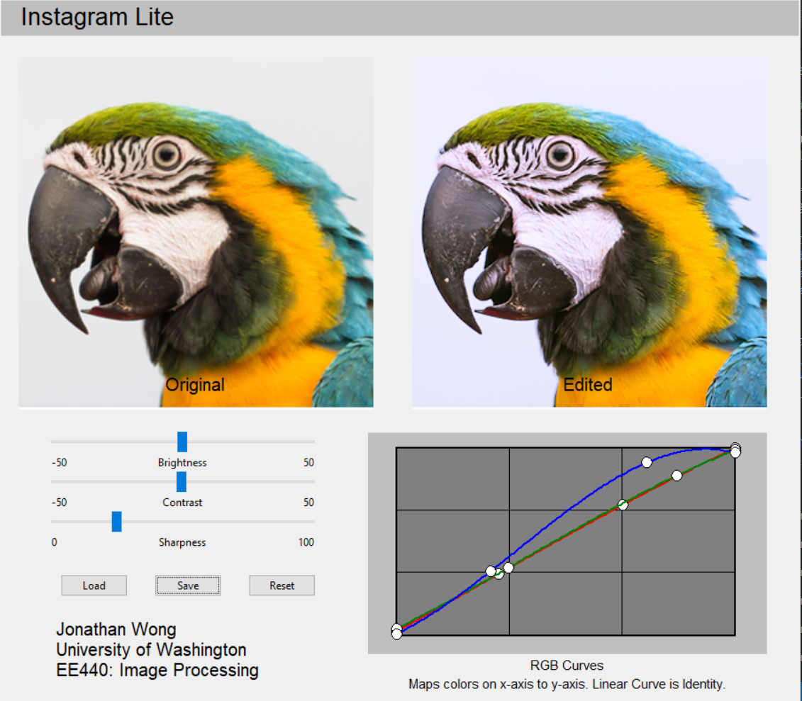
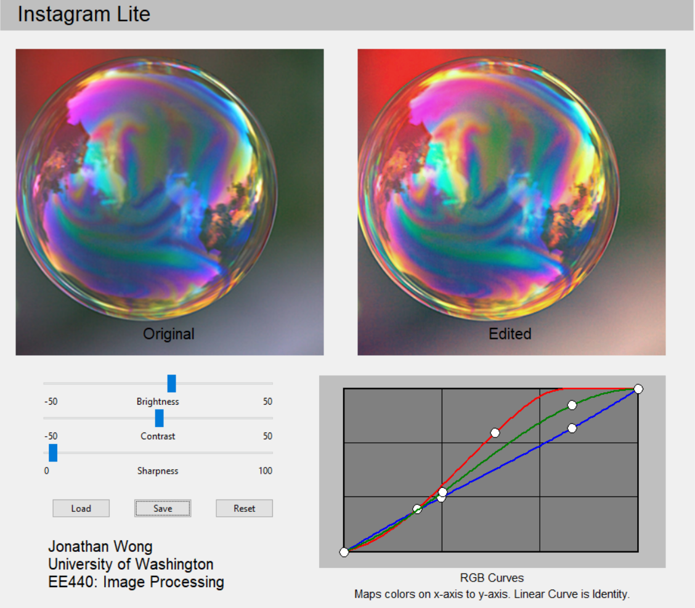

# Instagram-Lite

Image-Editing GUI made with OpenCV, Numpy, and Modern Tkinter.
Image Enhancement and Resizing performed with OpenCV.
Color Curve Interaction, Event Handling, and Geometry Management implemented with Tkinter.

Editing Features:
 - Color Correction
 - Brightness 
 - Contrast 
 - Sharpness 

Application Features:
 - Load
 - Save 
 - Reset

