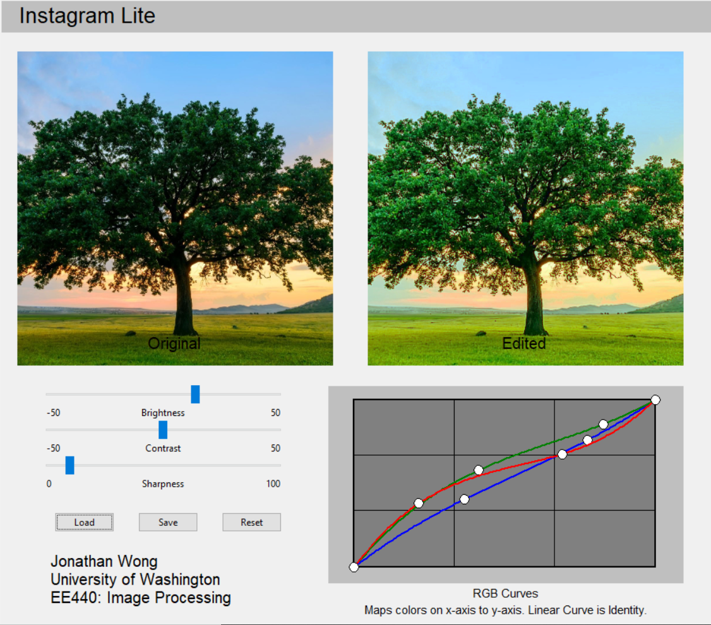

# Instagram-Lite

Image-Editing GUI made with OpenCV, Numpy, and Modern Tkinter.
Image Enhancement and Resizing performed with OpenCV.
Color Curve Interaction, Event Handling, and Geometry Management implemented with Tkinter.

Gif compression introduces some rendering artifacts.

Editing Features:
 - Color Correction
 - Brightness 
 - Contrast 
 - Sharpness 

Application Features:
 - Load
 - Save 
 - Reset

## Sample Images:

### Parrot:

### Tree:

### Bubble:

